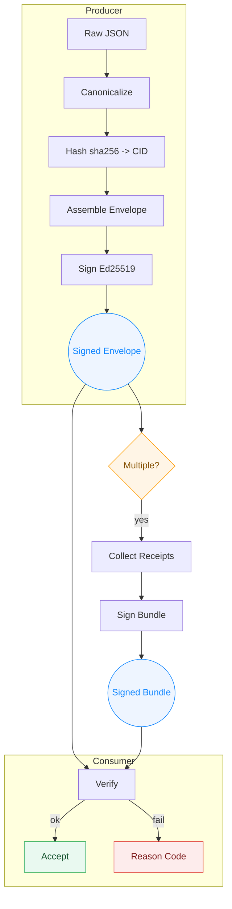
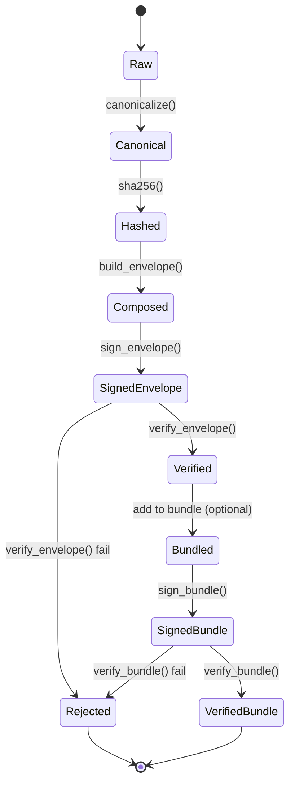
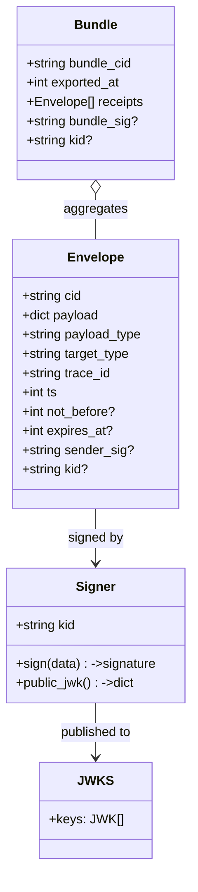
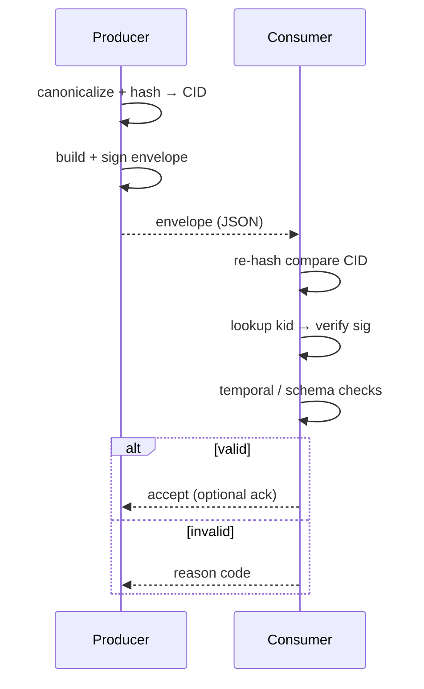

<div align="center">

# ODIN OPE – Open Proof Envelope

Robust, lightweight primitives for **verifiable payload exchange** across AI agents, services, and humans.

[](https://pypi.org/project/odin-ope/)
[](https://pypi.org/project/odin-ope/)
[](./LICENSE)
[](#)
[](#)
[](https://odinsecure.ai)
[](https://github.com/maverick0351a/Open-Proof-Envelope/actions/workflows/publish.yml)

</div>

---

## What Is OPE?

**OPE (Open Proof Envelope)** is a minimal, deterministic container + signing scheme:

1. Canonicalize a JSON payload (stable key ordering & encoding)
2. Compute a **CID** (`sha256:<hex>` of canonical bytes)
3. Assemble an **envelope** with metadata (`payload_type`, `target_type`, `trace_id`, timestamps)
4. Sign a compact string representation with **Ed25519** (`"{cid}|{trace_id}|{ts}"`)
5. Distribute or bundle these signed envelopes; receivers can verify and obtain fine‑grained failure reason codes.

It gives you a tamper‑evident, portable, and tool‑friendly way to prove *exactly* what JSON was processed or exchanged—ideal for audit trails, agent hand‑offs, chain‑of‑thought checkpoints, compliance artifacts, or marketplace receipts.

> Project Website: https://odinsecure.ai

### Key Guarantees
| Property | Description |
|----------|-------------|
| Determinism | Canonical serialization yields stable hashes & signatures |
| Integrity | Payload changes ⇒ different CID ⇒ verification fails |
| Authenticity | Ed25519 signatures tied to a `kid` (public key) in a JWKS |
| Temporal controls | Optional `not_before`, `expires_at`, skew bounds |
| Trace continuity | `trace_id` threads envelopes and bundles |
| Explainability | Structured reason codes on failure |

---

## Architecture Overview

Below are multiple focused views (pick the one you need). Each avoids visual noise while conveying core intent.

### 1. Layered Flow (System Perspective)


### 2. Lifecycle State Machine


### 3. Data Model (Conceptual)


### 4. Minimal Exchange Sequence


<details>
<summary>Why multiple views?</summary>

Different stakeholders scan for different dimensions: the layered flow helps onboarding; the state machine clarifies transitions & failure exits; the data model anchors naming; the sequence highlights network-facing steps.

</details>

---

## Installation
```bash
pip install odin-ope
# Extras (cloud KMS signers)
pip install "odin-ope[gcpkms]"
pip install "odin-ope[awskms]"
pip install "odin-ope[azurekv]"
```

---

## Quick Start
```python
from odin_ope.signers import FileSigner
from odin_ope.envelope import build_envelope, sign_envelope
from odin_ope.verify import verify_envelope, build_jwks_for_signers

seed_b64u = "A" * 43  # demo seed (base64url for 32 bytes). Use a secure random seed in production.
signer = FileSigner(seed_b64u=seed_b64u)

payload = {"invoice_id": "INV-1", "amount": 100.25, "currency": "USD"}
env = build_envelope(
        payload,
        payload_type="openai.tooluse.invoice.v1",
        target_type="invoice.iso20022.v1",
)
signed_env = sign_envelope(env, signer)

jwks = build_jwks_for_signers([signer])
ok, reason = verify_envelope(signed_env, jwks)
assert ok, reason
```
See `examples/end_to_end.py` for an extended demonstration (including bundles and receipts).

---

## CLI
After installation a `odin-ope` CLI is available:
```bash
odin-ope sign-envelope \
    --payload payload.json \
    --payload-type my.type.v1 \
    --target-type my.target.v1 \
    --seed <base64url-seed> \
    --not-before "+0" --expires-at "+3600"

odin-ope verify-envelope --envelope env.json --jwks jwks.json --json --strict --max-skew 300
```
Flags:
- `--json` structured output (machine friendly)
- `--strict` enforces schema & required fields
- `--no-skew` disables clock skew tolerance
- `--max-skew` override default skew seconds

---

## Reason Codes
| Code | Meaning |
|------|---------|
| cid_mismatch | Payload hash changed after signing |
| missing_sig_or_kid | Envelope missing sender_sig or kid |
| kid_not_found | KID not present in supplied JWKS |
| signature_invalid | Signature verification failed |
| timestamp_skew | ts outside allowed skew window |
| schema_error | Structural or field validation error |
| not_yet_valid | not_before is in the future |
| expired | expires_at is in the past |

Use `verify_envelope_or_raise` for exceptions; map to enumerated `ReasonCode` for analytics.

---

## FAQ
**ModuleNotFoundError**: Ensure installation succeeded (`pip show odin-ope`) or use editable install: `pip install -e .`.

**Bad seed length**: Ed25519 seed must decode to exactly 32 bytes (base64url without padding).

**CID mismatch**: The payload mutated post-signing—never modify a signed envelope's `payload` or `cid`.

**Generating a seed**:
```python
import os, base64
seed = base64.urlsafe_b64encode(os.urandom(32)).rstrip(b"=").decode()
```

---

## Development
```bash
pip install -e .[dev]
pytest -q
mypy src/odin_ope
python scripts/gen_sbom.py --out sbom.json  # CycloneDX SBOM
```
Programmatic version:
```python
import odin_ope; print(odin_ope.__version__)
```

---

## Publishing (Automation Ready)
GitHub Actions workflow (`.github/workflows/publish.yml`) supports: lint, type-check, tests (coverage), build, SBOM, provenance attestation, PyPI publish. Add a `PYPI_API_TOKEN` secret and push a signed tag (e.g. `v0.9.0`).

### Links
- Website: https://odinsecure.ai
- PyPI: https://pypi.org/project/odin-ope/
- GitHub: https://github.com/maverick0351a/Open-Proof-Envelope

---

## Security & Integrity
- Ed25519 only (modern, fast, deterministic)
- Canonical JSON prevents hash ambiguity
- Temporal fields (`not_before`, `expires_at`, skew) mitigate replay
- SBOM + provenance to strengthen supply chain trust
See `SECURITY.md` for coordinated disclosure process.

---

## Roadmap (Selected)
- Multi-signer envelopes
- Streaming / large-payload hashing adapters
- Pluggable policy hooks (custom temporal / business rules)
- Threat model & formal spec doc

---

## Contributing
Issues & PRs welcome. See `CONTRIBUTING.md` and follow the style / type hints / tests guidelines.

---

## License
Apache-2.0
